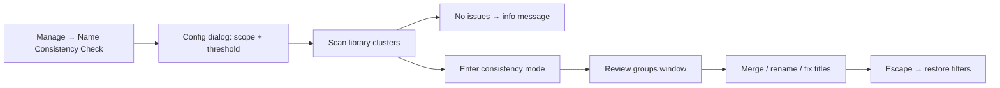

# Name Consistency Check — Future Improvement Plan

**Status:** Planned (not yet implemented)  
**Created:** June 2026  
**Related:** [Duplicate Mode Process](07_duplicate_mode_process.md), [Import Process](02_import_process.md)

---

## What this is

A post-import library cleanup tool modeled on **Duplicate Mode**. It scans the existing database for similar author, title, and genre spellings (for example `John Connelly` / `John Connely` / `John Conelly`), groups them, and lets the user merge variants into a canonical name.

This is **not** run during import — import stays fast. The user runs the check on demand from the Manage menu, similar to **Manage → Duplicate Check**.

---

## Problem

- Imports and manual entry create spelling variants as separate `authors` rows or inconsistent book titles.
- Fuzzy duplicate detection during import only **blocks** near-matches; it does not help fix them.
- Genre strings fragment similarly (`Sci-Fi`, `Science Fiction`, `Fiction > Mystery`).
- [`AuthorQueries.update`](src/database/queries.py) renames one row only; it does not merge two author IDs.

---

## Recommended approach

Mirror the duplicate-mode lifecycle in [`src/ui/main_window.py`](src/ui/main_window.py):



| Duplicate Mode (existing) | Name Consistency Check (new) |
|---|---|
| Exact key groups books | Fuzzy similarity groups **names** |
| Filters main book table | Opens dedicated **review window** (names, not book rows) |
| Delete / export duplicates | Merge author/genre IDs; bulk-fix titles |
| `duplicate_mode_active` flag | `consistency_mode_active` flag (blocks import like duplicate mode) |

A dedicated review window is better than filtering the book table because the unit of work is a **name cluster**, not a duplicate book row.

---

## 1. Core matching engine

**New file:** `src/core/name_consistency.py`

Reuse existing utilities from [`src/utils/text_utils.py`](../src/utils/text_utils.py) (`normalize_author`, `normalize_title`, `similarity_ratio`) and author token logic from [`src/ui/name_list_window.py`](../src/ui/name_list_window.py) (`_normalize_find_value`, token reorder for `"Smith, John"` vs `"John Smith"`).

### Author clustering

```python
def find_similar_author_groups(
    authors: list[Author],
    threshold: float = 0.85,  # 0–1, same scale as duplicate fuzzy
) -> list[SimilarGroup]:
    ...
```

Algorithm (fast enough for typical libraries):

1. Normalize each name (aggressive: strip punctuation/spaces, lower case).
2. Bucket by **first token + length band** to avoid O(n²) over full library.
3. Within bucket, pair names where `similarity_ratio(norm_a, norm_b) >= threshold`.
4. Also accept token-reorder match (existing name-list rank 6 logic).
5. Union-find or connected-components → one group per cluster.
6. Pick **suggested canonical** = variant with highest book count (tie-break: longest established name).

### Title clustering (optional scope)

Group books where **same `author_id`** AND title similarity ≥ threshold. Titles are per-book text (`books.title`), so fix = bulk update matching book rows to canonical title string (no merge table needed).

### Genre clustering

Same pattern as authors against `genres` table. Additionally normalize before compare:

- Split on `>`, `,`, `;` and compare leaf segment (handles web metadata like `Fiction > Mystery`).
- Trim and proper-case via existing [`ImportValidator.sanitize_metadata`](../src/core/validator.py).

### Settings

Add preferences (defaults in [Default preferences](14_default_preference.md)):

| Key | Default | Purpose |
|-----|---------|---------|
| `consistency/threshold` | 85 | Same 0–100 scale as import fuzzy duplicate |
| `consistency/scope` | `authors` | `authors`, `genres`, `titles`, or `all` |

Expose threshold + scope in a startup dialog (like duplicate match type combo). Reuse fuzzy threshold spinbox pattern from [`src/ui/preferences_window.py`](../src/ui/preferences_window.py).

---

## 2. Database merge operations (missing today)

[`AuthorQueries.update`](../src/database/queries.py) only renames one row. Spelling fix requires **merge**:

**Add to `src/database/queries.py`:**

```python
def merge(self, source_id: int, target_id: int) -> int:
    """Move all books from source to target, delete source if unused. Returns books updated."""
```

Same for `GenreQueries.merge`. After merge, call existing `cleanup_unused()`.

For **title fixes:** `BookQueries.bulk_update_title(book_ids, new_title)` (small new helper).

All merges in a single transaction.

---

## 3. Review UI

**New file:** `src/ui/consistency_check_window.py`

Accessible dialog/window (follow [`WebMetadataWindow`](../src/ui/web_metadata.py) checkbox-per-field pattern and duplicate dialog shortcuts):

**Columns per variant row:**

| Column | Content |
|--------|---------|
| Group | Group number |
| Name | Variant spelling |
| Books | Count affected |
| Suggested | Radio/check: mark as canonical |

**Actions:**

- **Merge selected group** (Alt+M) — merge non-canonical IDs into chosen canonical; announce `"Merged 3 authors into John Connelly, 4 books updated"`.
- **Skip group** (Alt+S) — leave unchanged, move to next.
- **Export report** (Alt+X) — CSV of groups for offline review (parallel to duplicate export).
- **Escape** — confirm exit; restore main window state.

For **title groups:** show title variants under one author; applying fix updates book title strings directly.

Register shortcuts via [`ShortcutContext`](../src/accessibility/shortcuts.py) (new `CONSISTENCY_DIALOG` context).

---

## 4. Main window integration

In [`src/ui/main_window.py`](../src/ui/main_window.py):

- Add **Manage → Name Consistency Check...** (Alt+M, then new letter — e.g. **N**).
- `on_consistency_check()` — config dialog → run engine → open review window or show "no issues".
- `consistency_mode_active` flag — same guardrails as duplicate mode (import exits mode; status bar label; disable unrelated actions while reviewing).
- Do **not** filter the book table; keep review in the dedicated window.

---

## 5. Genre normalization (phased)

### Phase 1 (included with consistency check)

- Fuzzy cluster existing library genres (same engine as authors).
- Parse hierarchical strings before compare: `"Fiction > Mystery"` → compare `"Mystery"` as well as full string.
- Merge duplicates via `GenreQueries.merge`.
- Suggested canonical = most-used genre in library.

### Phase 2 (optional later)

- **Alias map** preference table: user-defined `Sci-Fi → Science Fiction` applied before clustering.
- **Web import hint:** when applying web metadata, suggest closest existing genre (reuse `similarity_ratio`) instead of always `get_or_create` — still post-fetch, not during folder scan.
- **Controlled vocabulary:** optional seed list (BISAC/Open Library top subjects) as combo suggestions only — not enforced.

No new tables needed for Phase 1. Phase 2 alias map could be a simple `genre_aliases(alias, canonical)` table or QSettings JSON.

---

## 6. What this deliberately avoids

- **No import-time scanning** — import stays fast; user runs cleanup when ready.
- **No new heavy dependencies** — `difflib.SequenceMatcher` already used; no phonetic libraries unless accuracy proves insufficient later.
- **No automatic silent merges** — user confirms every group (accessibility + data safety).
- **No overlap with Duplicate Mode** — duplicates = same book twice; consistency = same person/genre spelled differently.

---

## 7. Implementation checklist

| # | Task | File(s) |
|---|------|---------|
| 1 | Create clustering engine (author/genre/title) | `src/core/name_consistency.py` |
| 2 | Add `merge()` for authors/genres; bulk title update | `src/database/queries.py` |
| 3 | Build review window with merge/skip/export | `src/ui/consistency_check_window.py` |
| 4 | Wire Manage menu, config dialog, mode flag | `src/ui/main_window.py` |
| 5 | Add threshold/scope preferences | `src/ui/preferences_window.py`, `doc/14_default_preference.md` |
| 6 | Register shortcut context | `src/accessibility/shortcuts.py` |
| 7 | Unit tests for clustering + merge | `test/test_name_consistency.py`, `test/test_author_genre_merge.py` |
| 8 | User guide (when implemented) | New process doc parallel to `07_duplicate_mode_process.md` |
| 9 | Cross-link from user index | `doc/01_user_index.md` |

---

## Key files to change

| File | Change |
|------|--------|
| `src/core/name_consistency.py` | **New** — clustering engine |
| `src/database/queries.py` | `merge()` for authors/genres; bulk title update |
| `src/ui/consistency_check_window.py` | **New** — review/merge UI |
| `src/ui/main_window.py` | Menu entry, mode flag, launcher |
| `src/ui/preferences_window.py` | Threshold + default scope (optional tab) |
| `src/accessibility/shortcuts.py` | New shortcut context |

---

## Existing building blocks

| Area | Location |
|------|----------|
| Text normalization / fuzzy match | `src/utils/text_utils.py` |
| Import duplicate fuzzy logic | `src/core/validator.py` |
| Author find / token reorder | `src/ui/name_list_window.py` |
| Duplicate mode pattern | `src/ui/main_window.py`, `doc/07_duplicate_mode_process.md` |
| Side-by-side suggest/apply UI | `src/ui/web_metadata.py` |
| Genre storage (free text, one per book) | `genres` table, `GenreQueries` |
