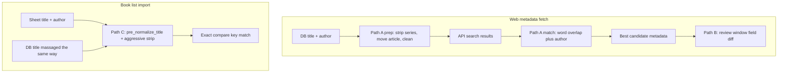

# Web Metadata Title Compare — Technical Reference

Read-only reference for how AbCS compares book titles during **web metadata fetch** and how that relates to **book list import**. This document describes current behavior; it does not propose changes to web fetch or the review window (those paths are working as intended).

**Related user guide:** [07_web_metadata.md](07_web_metadata.md)  
**Related import logic:** `src/utils/text_utils.py` (`compare_normalize_title`)  
**Web implementation:** `src/web/web_book_api.py`, `src/ui/web_metadata.py`

---

## Overview

AbCS uses **three separate title-compare strategies**, each tuned for a different job:

| Path | When it runs | Question being answered |
|------|----------------|-------------------------|
| **A. Web search / candidate pick** | Open Library, Google Books, WikiData | “Which API result belongs to this DB book?” |
| **B. Web metadata review window** | After a candidate is chosen | “Should we offer to change the title field?” |
| **C. Book list import** | Spreadsheet import (duplicate check, read-date match) | “Is this sheet row the same book as this DB record?” |

Paths A and B both live in the web metadata feature but **do not use the same rules**. Path C reuses the **search prep** ideas from path A (series strip, articles) but finishes with an **exact** compare key, not word overlap.

---

## Path A — Web search and candidate selection

**Files:** `WebBookAPI.get_book_metadata()`, `_metadata_matches_db()`, `_title_word_match_score()`, `_pick_best_google_match()`, Open Library / WikiData loops.

### DB title preparation (before any API call)

When fetch starts, the **raw DB title** is transformed into `search_title`:

1. **`_strip_series_number`** — removes clearly separated series suffixes, for example:
   - `Triptych - 01`
   - `Title #09`
   - `Title Book 09`
   - `Title Volume 09`
   - `Title, 09` (skipped if the number looks like a publication year, 1700–2099)
2. **`_move_article_to_beginning`** — `Sentinel, The` → `The Sentinel`
3. **`_clean_text_field`** — collapse spaces, trim leading junk, remove odd characters

The extracted `series_number` may be **re-appended** to the fetched title later if preferences request it; it is **not** part of the search query.

Author side (for matching, not detailed here): honorifics stripped, light cleanup via `_apply_author_transformations`.

### How a web candidate is accepted

For each API hit, `_metadata_matches_db()` requires:

1. **Title:** `_title_matches()` — at least **50%** of meaningful DB words (from `search_title`) appear in the web title.  
   - Words are tokenized with `\b\w+\b`; stopwords removed: `the`, `a`, `an`, `and`, `or`, `of`, `in`, `on`, `to`, `for`.  
   - If the web title has more than twice as many meaningful words as the DB side, score is reduced by 0.15 (reduces false positives on very long web titles).
2. **Author (when required):** web author must contain the DB author’s **last name**; if both sides have multiple words, some given-name overlap is also required.

Among candidates that pass, the one with the **highest** `_title_word_match_score` wins.

### Design intent

- Tolerant matching: web catalogs often use longer or slightly different titles.
- `search_title` is the DB title **after** series strip — so `Triptych - 01` in the DB is compared as `Triptych` against the web.
- **Not** exact string equality.

### Integer-only series suffix note

Web `_strip_series_number` uses integer patterns (`\d+`). Decimal series entries such as `Busted - 6.5` are **not** stripped on the web path. Book list import’s `strip_series_number` in `text_utils.py` extends this with decimal support; web code was left unchanged.

---

## Path B — Web metadata review window

**Files:** `WebMetadataWindow._compare_scalar_field()`, `compute_field_differences()`, module function `web_book_api.normalize_title()`.

After path A returns metadata, the review window decides which fields differ from the **current DB record** so checkboxes can be shown.

### Title comparison (review only)

For the **title** field only:

1. Current DB value: `book.title` as stored (e.g. `Triptych - 01`) — **not** re-run through `_strip_series_number`.
2. Web value: fetched title as returned from the API (possibly with series re-appended).
3. Both sides passed through **`normalize_title()`** in `web_book_api.py`:
   - Move trailing article: `Title, The` → `the title`
   - Lowercase, remove **spaces** (punctuation kept until spaces removed by join)

Other scalar fields use simple `.lower()` on trimmed strings.

A title is offered as a change when normalized web ≠ normalized current, or when current is empty.

### Design intent

- Simple, predictable “is the title text different?” for the UI.
- Lighter than path A: **no** series-number strip, **no** word overlap.
- A book can pass path A (good API match) yet still show a title difference in the review table — for example DB `Triptych - 01` vs web `Triptych`.

### Why path A and path B differ

| Aspect | Path A (search) | Path B (review) |
|--------|------------------|-----------------|
| DB title input | `search_title` after series strip + clean | Raw `book.title` |
| Web title input | Raw candidate from API | Fetched metadata title |
| Compare method | Word overlap ≥ 50% | Normalized string equality |
| Author | Required for candidate gate | Compared separately in field diff |

This split is **intentional**: search must be fuzzy; the review UI must be easy to reason about field-by-field.

---

## Path C — Book list import (for context)

**Files:** `book_list_import_window.py`, `text_utils.compare_normalize_title()`.

Import compares a **spreadsheet title** to **DB titles** for duplicate detection and read-date updates. It does **not** call web APIs.

### Preparation (`pre_normalize_title`)

Aligned with **path A search prep** (implemented in `text_utils.py`, not by calling web code):

1. **`strip_series_number`** — same suffix patterns as web, plus decimals (`6.5`)
2. Trailing **parenthetical** series markers when content looks series-like or contains digits
3. **`_move_article_to_beginning`** equivalent for comma-articles

Then **`normalize_title(aggressive=True)`** removes all spaces and punctuation and lowercases — producing a single **exact** compare key.

### Compare method

**Exact equality** on the compare key, plus author normalization. Optional fuzzy duplicate threshold from Preferences (folder import rules) applies in **add-book** mode only.

### Design intent

- Sheet rows are usually plain titles (`Triptych`); DB often has AbCS series suffixes (`Triptych - 01`).
- Massage **both** sides the same way, then require an exact key match — appropriate for “same book?” in a list, not “closest API hit.”

---

## Quick examples

| DB stored | Sheet / search input | Path A (`search_title`) | Path A match style | Path B title diff? | Path C import key |
|-----------|----------------------|-------------------------|--------------------|--------------------|-------------------|
| `Triptych - 01` | `Triptych` | `Triptych` | Word overlap vs web `Triptych` | Often yes (suffix vs plain) | `triptych` = `triptych` |
| `Hobbit, The` | `The Hobbit` | `The Hobbit` | Word overlap | Depends on web title | `thehobbit` = `thehobbit` |
| `Still Life (A Three Pines Mystery)` | `Still Life` | Unchanged (paren not stripped in web) | May still match via word overlap | Often yes | May not match import (paren kept on DB side unless series-like) |
| `Bury Your Dead (Armand Gamache 6)` | `Bury Your Dead` | Unchanged in web strip | Word overlap may match | Often yes | Matches import (digit in paren stripped) |

---

## File map

| Concern | Location |
|---------|----------|
| Series strip (web) | `WebBookAPI._strip_series_number()` |
| Search title pipeline | `WebBookAPI.get_book_metadata()` (~lines 832–836) |
| Word overlap / author gate | `WebBookAPI._title_word_match_score()`, `_metadata_matches_db()`, `_author_matches()` |
| Review title normalize | `web_book_api.normalize_title()`, `WebMetadataWindow._compare_scalar_field()` |
| Field diff table | `WebMetadataWindow.compute_field_differences()` |
| Import compare | `text_utils.pre_normalize_title()`, `compare_normalize_title()` |
| Import UI | `BookListImportWindow._check_duplicate()`, `update_read_dates()` |

---

## Summary

- **Web fetch works in two steps:** fuzzy **pick** (path A) then strict **field diff** for the UI (path B). They serve different purposes; they are not meant to use identical title strings.
- **Book list import** (path C) borrowed **search prep** (especially series suffix removal) but uses **exact** keys — fixing cases like Karin Slaughter `Triptych` vs `Triptych - 01` without modifying web metadata code.
- **No web metadata changes are required** when import matching is the goal; keep web and import logic separate unless a real web-fetch miss is observed in testing.

---

*Document purpose: developer/agent reference. Last aligned with codebase: June 2026.*
