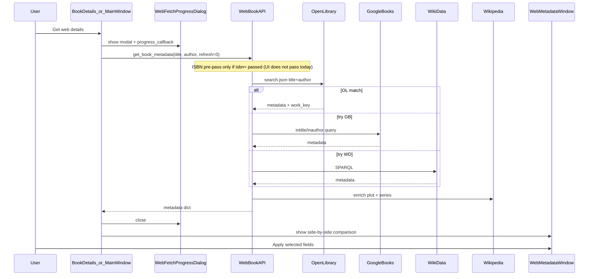

# Web Fetch Improvement — June 5, 2026

Review of AbCS book metadata retrieval from the web, with recommendations focused on **plot**, **series**, and comparison fields (**title**, **author**, **year**, **genre**).

Primary implementation: [`src/web/web_book_api.py`](../src/web/web_book_api.py)  
UI entry points: [`src/ui/book_details.py`](../src/ui/book_details.py), [`src/ui/main_window.py`](../src/ui/main_window.py)  
Review/apply UI: [`src/ui/web_metadata.py`](../src/ui/web_metadata.py)

---

## 1. Purpose and goals

When the user requests web details for a book, AbCS should:

1. **Retrieve** plot and series information (primary enrichment targets).
2. **Compare** web results against the local database for title, author, year, and genre so the user can selectively apply changes in `WebMetadataWindow`.
3. **Avoid wrong-book matches** — same title, different author, or subtitle noise must not overwrite library data.

The current design achieves this through a multi-source cascade, conservative matching rules, and a post-match enrichment phase. This document reviews that design and recommends targeted improvements. **Note:** the database does not store ISBN and no schema change is planned. ISBN is used only in-flight — when a search result returns one, it can be reused for targeted enrichment without any DB involvement.

---

## 2. Current process

### 2.1 End-to-end flow



All network I/O runs **synchronously on the UI thread** while `WebFetchProgressDialog` updates status text for screen readers.

### 2.2 Source cascade (`refresh` parameter)

| `refresh` | Sources tried (in order) | Typical use |
|-----------|--------------------------|-------------|
| `0` (default) | Open Library → Google Books → WikiData | First fetch from Book Details / Main Window |
| `1` | Google Books → WikiData | Re-fetch from Web Metadata window |
| `2` | WikiData only | Rare / testing |

Each source query is followed by a **matching gate** before the result is accepted.

### 2.3 Matching gate (all text-search sources)

Before accepting a hit from Open Library, Google Books, or WikiData:

- **Title**: at least 50% of significant DB title words (stopwords removed) must appear in the web title; penalty when the web title is much longer (reduces subtitle false positives).
- **Author**: DB author last name must appear in web author; when both sides have multiple tokens, at least one non-last-name token must match.
- **Year**: DB year is **not sent to search APIs** (library years are often wrong). Year is returned for comparison only.

If strict title+author search fails:

1. **Broadened search** — same title, no author in query, but author still used for filtering (`broadened_search: True`).
2. **Title-only search** — for LibriVox-style records (empty author, narrator=author, path contains "librivox", etc.) (`title_only_search: True`).

### 2.4 Post-match enrichment (always runs on success)

After a source wins, `_finish_metadata` runs:

1. **`_enrich_metadata_plot`** — Open Library work description → OL fallback search → Wikipedia REST (WikiData wins only) → Wikipedia search/extract → keep Google description.
2. **`_fill_series_fields`** — seed from DB title number (e.g. Jack Reacher heuristic) → Open Library work → Google series re-query → WikiData series SPARQL.

This means **extra HTTP requests always occur** even when the primary source already returned adequate data.

### 2.5 Fields retrieved vs. UI comparison

| Field | Primary sources | Enrichment | Shown in WebMetadataWindow |
|-------|-----------------|------------|----------------------------|
| Title | OL, GB, WD | Series number may be appended from DB title | Yes |
| Author | OL, GB, WD | — | Yes |
| Year | OL, GB | — | Yes |
| Genre | OL subjects, GB categories | — | Yes |
| Plot | OL work, GB description | Wikipedia, OL fallback | Yes |
| Series / series_number | OL work, GB seriesInfo | Google re-query, WikiData | Yes |
| ISBN | OL search, GB identifiers | OL ISBN endpoint | Not stored — discovered in-flight from search results only; used internally for enrichment |
| Rating | OL, GB | Stored in comments if applied | Embedded in comments |

The `Book` model and SQLite schema have **no ISBN column** and none is planned. The API accepts `isbn=` as an optional runtime parameter but UI callers do not pass it.

### 2.6 Caching

- In-memory TTL: 300 seconds.
- Persistent file: `data/web_cache.json` (max 200 entries).
- Cache key: `title|author|refresh|narrator|path|source|search_without_author` — does not include `isbn` (isbn is an optional runtime parameter, not sourced from the DB).
- Only successful lookups are cached; failures are not.

### 2.7 External endpoints

| Source | Endpoint | Timeout | Notes |
|--------|----------|---------|-------|
| Open Library search | `openlibrary.org/search.json` | 10s | Returns `isbn` in fields but ISBN is not stored on match |
| Open Library work | `openlibrary.org/works/{id}.json` | 6s | Description, series |
| Open Library ISBN | `openlibrary.org/isbn/{isbn}.json` | 6s | Edition-level; requires follow-up work fetch for plot/series |
| Google Books | `googleapis.com/books/v1/volumes` | 6s | `intitle:` / `inauthor:`; returns `seriesInfo`, `description` |
| WikiData | `query.wikidata.org/sparql` | 6s | P179 series, P1545 series number |
| Wikipedia REST | `en.wikipedia.org/api/rest_v1/page/summary/{title}` | 6s | Fast plot for notable books |
| Wikipedia API | `en.wikipedia.org/w/api.php` | 6s | Search + extract fallback |

---

## 3. In-flight ISBN reuse — analysis

### 3.1 What in-flight ISBN means

The database does not store ISBN. However, Open Library and Google Books search responses often include ISBN fields in the matched document. Rather than discarding that value, it can be reused within the same fetch call to drive more accurate enrichment queries — no DB change required.

**In-flight discovery:**  
After a title+author text search returns a match, extract `isbn` from the response document and issue ISBN-targeted queries for richer plot/series data.

### 3.2 Current ISBN support

The API has an ISBN pre-pass intended for direct lookups:

```python
# get_book_metadata — lines 747–756
if isbn:
    _report_progress("Looking up ISBN on Open Library…")
    isbn_meta = self._fetch_by_isbn(isbn)
    if isbn_meta and not isbn_meta.get("_no_result"):
        return _finish_metadata(isbn_meta, "open_library_isbn", first_attempt=True)
```

`_fetch_by_isbn` (lines 570–632):

- Calls Open Library ISBN endpoint only (not Google Books).
- Returns title, author, year, work key — **no plot, genre, or series** at this stage.
- Plot/series come from the standard enrichment phase via work key.

**Gap:** UI never passes `isbn=` (no DB storage planned), so this pre-pass is unreachable. It remains as a future hook. The near-term opportunity is reusing ISBNs that appear in text-search responses.

### 3.3 When in-flight ISBN reuse helps

| Benefit | Explanation |
|---------|-------------|
| **Disambiguation on enrichment** | When an ISBN is found in the matched document, enrichment queries hit a specific edition — no fuzzy matching needed. |
| **Better series from Google Books** | `seriesInfo.volumeSeries[0].seriesTitle` + `bookDisplayNumber` is structured; more reliable than subtitle regex parsing. |
| **Reliable plot from Google Books** | `isbn:` enrichment query returns edition-specific `description` for mainstream fiction. |

### 3.4 Limitations of in-flight ISBN reuse

| Limitation | Explanation |
|------------|-------------|
| **Many audiobook records return no ISBN** | Not every edition is in OL/GB with an ISBN field. Text-search fallback remains essential. |
| **Edition mismatch** | Audiobook ISBN may differ from print edition. Plot/series usually still match; year/publisher may differ. |
| **Open Library ISBN coverage gaps** | Not every audiobook edition is catalogued; enrichment still needs work fetch. |
| **No net latency saving** | Text search still required first; ISBN reuse eliminates a second fuzzy search, not the initial one. |

### 3.5 Verdict

| Scenario | In-flight ISBN helpful? | Recommendation |
|----------|-------------------------|----------------|
| ISBN found in OL/GB search response | **Yes — quality improvement** | Reuse for targeted Google Books `seriesInfo` / plot enrichment |
| No ISBN in search response | **N/A** | Standard cascade continues unchanged |
| LibriVox / title-only records | **No** | Keep existing title-only fallback |
| Re-fetch (`refresh=1`) | **Partial** | If a prior result cached an ISBN, it could skip OL text search |

**Bottom line:** Since the DB does not store ISBN, the only practical opportunity is reusing ISBNs that appear in the matched search response — all in-flight. This improves series and plot quality (especially via Google Books `seriesInfo`) without any schema change or extra discovery round-trips.

---

## 4. Strengths of the current design

1. **Conservative matching** reduces wrong-book merges; broadened and title-only fallbacks handle edge cases without abandoning author checks entirely.
2. **Separate enrichment phase** keeps primary source selection simple and allows plot/series to be filled from the best specialist source regardless of which API matched first.
3. **WikiData series SPARQL** (P179/P1545) is already used in `_enrich_metadata_series` — the most reliable structured series source.
4. **LibriVox awareness** — narrator-as-author and path heuristics address a real audiobook catalog pattern.
5. **Accessibility** — progress messages and screen-reader announcements during blocking fetch.
6. **Test coverage** — matching gate, cascade order, plot enrichment, series parsing, and progress messaging are tested in `test/test_web_book_api_matching.py`, `test/test_web_series.py`, `test/test_web_fetch_progress.py`.

---

## 5. Weaknesses and gaps

1. **ISBN pre-pass is unreachable** — API supports `isbn=` but UI never passes it (no DB storage). The code exists as a future hook only.
2. **ISBN from search results is discarded** — Open Library search requests the `isbn` field but does not reuse it for enrichment.
3. **Plot enrichment order suboptimal for common fiction** — Wikipedia REST summary (fast, high quality for notable books) runs only when WikiData is the winning source, not for OL/GB wins.
4. **Series enrichment re-queries Google by title** — `_fetch_series_from_google` repeats the full title+author search instead of using a discovered ISBN.
5. **Cache key omits ISBN** — an ISBN lookup could incorrectly return a prior non-ISBN cache entry for the same title (low risk while pre-pass is unreachable).
6. **Synchronous UI-thread fetch** — sequential HTTP calls stack latency; worst case is OL + GB + WD + enrichment (6–10+ requests).

---

## 6. Proposed improvements

Prioritized by impact on plot/series quality and comparison accuracy.

### 6.1 Extend ISBN pre-pass to Google Books (Low — future hook only)

**What:** Add `_fetch_google_by_isbn(isbn)` calling `https://www.googleapis.com/books/v1/volumes?q=isbn:{isbn}` with fields for `description`, `seriesInfo`, `categories`, `publishedDate`, `authors`, `title`.

**Why:** Google Books `seriesInfo` is the most reliable automated series source for mainstream series fiction. This extends the existing `_fetch_by_isbn` pre-pass to also try Google Books. No practical effect until the pre-pass becomes reachable.

**How:** In `_fetch_by_isbn` or a new `_fetch_metadata_by_isbn` orchestrator:

1. Try Google Books ISBN query first (richer plot/series).
2. Fall back to Open Library ISBN + work fetch for gaps.
3. Merge results (prefer GB for plot/series; prefer OL for subjects/genre if GB categories empty).

**Effort:** Small — one new method, merge logic in existing pre-pass. Low priority while ISBN is never passed by the UI.

### 6.2 Reuse discovered ISBN for series/plot enrichment (High)

**What:** When Open Library or Google Books text search returns an ISBN on the matched document, store it on the metadata dict and pass it to:

- Google Books `isbn:` query in `_enrich_metadata_series` (instead of repeating full title search).
- Optional plot enrichment if current plot is inadequate.

**Why:** One precise request replaces a fuzzy re-search; improves series accuracy without adding a discovery step and with no DB involvement.

**Implementation sketch:**

```python
# After OL match, if doc has isbn and no series:
isbn_list = doc.get("isbn", [])
if isbn_list and not metadata.get("series"):
    gb_hit = self._fetch_google_by_isbn(isbn_list[0])
    self._apply_series_to_metadata(metadata, ...)
```

**Effort:** Small.

### 6.4 Try Wikipedia REST summary earlier for plot (Medium)

**What:** In `_enrich_metadata_plot`, call `_fetch_wikipedia_rest_summary(title)` **before** the full Wikipedia API search+extract path, for all winning sources — not only WikiData.

**Why:** Single GET, ~6s timeout, returns a clean paragraph for any book with a Wikipedia article. Cheaper than OL fallback search + Wikipedia search combined.

**Caution:** Match plot text against DB title/author (existing `_apply_plot_to_metadata` gate) to avoid wrong-article summaries.

**Effort:** Small — reorder existing calls.

### 6.5 Promote WikiData series query earlier in enrichment (Medium)

**What:** In `_enrich_metadata_series`, run `_fetch_series_from_wikidata` **before** the Google title re-query when series is still missing after OL work fetch.

**Why:** WikiData P179/P1545 is more reliable than Google subtitle/description parsing. Google re-query by title is redundant when an ISBN-backed query (6.2) is available.

**Suggested order:**

1. OL work (if work_key present) — already first.
2. WikiData series SPARQL — move up.
3. Google Books by ISBN (if ISBN discovered in-flight from match) — new.
4. Google Books by title — last resort.

**Effort:** Small — reorder + ISBN hook from 6.2.

### 6.6 Include `isbn` in cache key (Low — no practical effect today)

**What:** Append `isbn` to the cache key in `get_book_metadata` (line 678).

**Why:** Prevents a non-ISBN cached result from masking an ISBN-backed lookup for the same title. Currently a no-op since the UI never passes `isbn=`, but safe to add now.

**Effort:** Trivial.

### 6.7 Update progress messages for ISBN path (Low)

**What:** Change "Looking up ISBN on Open Library…" to reflect multi-source ISBN lookup, e.g. "Looking up ISBN…".

**Effort:** Trivial.

### 6.8 Optional: parallel enrichment (Future / larger refactor)

**What:** Run plot enrichment and series enrichment concurrently (`ThreadPoolExecutor`) since they hit different endpoints, or move the entire `get_book_metadata` call off the UI thread via `QThread` / `QRunnable`.

**Why:** Could cut enrichment wall-clock time roughly in half and prevent UI freezes during long cascades.

**Caution:** Qt UI thread constraints; progress callbacks must marshal back to the main thread for `WebFetchProgressDialog` updates. Screen reader announcements depend on focus timing on the dialog.

**Status:** Deferred post-merge. Current synchronous design is acceptable for typical fetches; revisit if users report timeouts or unresponsive UI during web lookup.

**Effort:** Large — out of scope for the polished branch merge.

---

## 7. Comparison table — current vs. recommended

| Scenario | Current behaviour | Recommended |
|----------|-------------------|-------------|
| ISBN pre-pass (`isbn=` param) | Open Library only; unreachable (UI never passes it) | Add Google Books support; remains a future hook |
| ISBN found in OL/GB search response | Discarded | Reuse for Google Books `seriesInfo` / plot enrichment (6.2) |
| Series missing after OL/GB | OL work → Google title re-query → WikiData | OL work → WikiData → Google by discovered ISBN → Google by title (6.5) |
| Plot: OL/GB wins | OL work desc → OL fallback → Wikipedia search | Add Wikipedia REST summary as early attempt (6.4) |
| Plot: WikiData wins | Wikipedia REST summary | No change |
| Cache | ISBN not in key | Include ISBN param in key (6.6, no-op today) |
| UI comparison | title, author, year, genre, plot, series | No change — ISBN not stored |

---

## 8. Recommended implementation order

1. **6.2** — Reuse discovered ISBN for Google enrichment (no schema change, immediate series/plot quality gain).
2. **6.4** — Wikipedia REST summary earlier (plot quality for well-known books).
3. **6.5** — Reorder series enrichment (WikiData before Google title re-query).
4. **6.6, 6.7** — Cache key and progress message fixes (trivial, do alongside 6.5).
5. **6.1** — Extend ISBN pre-pass to Google Books (future hook, low priority while UI cannot pass ISBN).

---

## 9. Testing recommendations

Add or extend tests in `test/test_web_book_api_matching.py` and `test/test_web_series.py`:

- Google Books ISBN mock returns `seriesInfo` → series fields populated without title re-search (validates 6.2).
- OL match response that includes `isbn` field → in-flight ISBN reused for Google Books enrichment.
- Wikipedia REST summary attempted for OL/GB winning source (mock REST endpoint, validates 6.4).
- Series enrichment order: WikiData called before Google title re-query when OL work has no series (validates 6.5).
- Cache key with `isbn=` param differs from cache key without (validates 6.6 — even while unreachable in production).

---

## 10. Summary

The web fetch pipeline is structured for **comparison and safe matching**, with strong fallbacks for audiobook-specific catalog quirks.

**Implemented (June 2026):**

- **6.2** — In-flight ISBN reuse from Open Library / Google Books search hits for targeted series and plot enrichment
- **6.4** — Wikipedia REST summary attempted early for all winning sources (not only WikiData)
- **6.5** — Series enrichment order: Open Library work → WikiData → Google by ISBN → Google by title
- **6.6 / 6.7** — ISBN included in cache key; unified “Looking up ISBN…” progress text
- **6.1** — ISBN pre-pass orchestrator tries Google Books first, then Open Library (hook only; UI does not pass ISBN)

**Still open / future:**

- **6.8** — Move network fetch and enrichment off the UI thread (parallel or worker-based); see §6.8
- **ISBN pre-pass from UI** — No DB ISBN column; direct `isbn=` pre-pass remains unreachable until import/tags supply one
- **Rating field** — Web rating shown in UI but stored only inside comments text, not a dedicated DB column

The hybrid approach in production: text search to find the book, then reuse any ISBN from the matched response to sharpen series and plot enrichment — all in-flight, no schema changes required.
