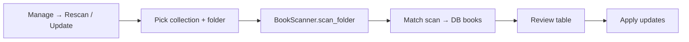

# Rescan / Update Metadata and Collection Library Folders — Future Improvement Plan

**Status:** Planned (not yet implemented)  
**Created:** June 2026  
**Related:** [Import process](help_docs/02_import.md), [Import explained](help_docs/19_import_explained.md), [Collections](help_docs/05_collections.md), [Preferences](help_docs/10_preferences.md), [Plan_name_consistency_check.md](Plan_name_consistency_check.md)

---

## Why one plan for two ideas

This document covers:

1. **Re-scan books to update metadata** — like import, but updates existing library rows instead of adding duplicates.
2. **Collection library folders** — optional root path per collection, default scan target, and (later) optional file organize/move.

They belong together because a **collection `root_path`** is the natural anchor for “rescan this collection’s tree” without browsing every time. File **move/organize** is a separate phase with higher risk; it is not required for rescan to ship.

**Open audiobook location** (file manager) is a separate plan: [`plan_audiobook_preview.md`](plan_audiobook_preview.md).

---

## What this is

### Part A — Collection root path (foundation)

Each collection may have an optional **library root folder** on disk. Import and rescan default to that folder when the collection is selected. No files are moved in Part A.

### Part B — Rescan / update from folder

**Manage → Rescan / Update…** opens a window modeled on [`ImportWindow`](src/ui/import_window.py): scan audio files, match to existing DB books, show a review table, apply **updates** to file-derived (and optionally tag) fields.

### Part C — Organize into library (optional, later)

Wizard to **copy or move** audiobook folders/files into a layout under the collection root (e.g. `{root}/{author}/{title}/`) and update `books.path`. Explicit opt-in with preview and dry-run.

---

## Problem

| Today | Gap |
|-------|-----|
| Import adds new books; duplicates stay in review list | No way to refresh metadata for books already in the DB |
| [`UpdateWindow`](src/ui/update_window.py) | Bulk-edits series, genre, collection only — not duration, path, tracks, tags |
| [`collections` table](test/fixtures/abcdDB_def.sql) | `name`, `active` only — no disk root |
| Global [`import/default_directory`](src/ui/preferences_window.py) | One default for all collections |
| `books.path` | Points wherever files were at import time; may be stale after user moves files on disk |

---

## Part A — Collection root path

### Schema

Add to `collections` in [`connection.py`](src/database/connection.py) `column_specs`:

```text
root_path  TEXT
```

Update [`models.py`](src/database/models.py) `Collection`:

```python
root_path: str = ""
```

Update [`CollectionQueries`](src/database/queries.py): `insert`, `update`, `get_by_id`, list queries.

Update [`test/fixtures/abcdDB_def.sql`](test/fixtures/abcdDB_def.sql).

### UI — Collections manager

[`src/ui/name_list_window.py`](src/ui/name_list_window.py) (collection mode) and/or [`collection_window.py`](src/ui/collection_window.py):

- Add **Library root folder** row: `QLineEdit` + **Browse** (Alt+B pattern from preferences).
- `setAccessibleName("Collection library root folder")`
- `setAccessibleDescription("Optional folder on disk where this collection's audiobooks live. Used as default for import and rescan.")`
- Save to `collections.root_path` on add/rename flows.

### UI — Import window

[`src/ui/import_window.py`](src/ui/import_window.py):

- When user selects target collection, if `collection.root_path` is set and folder exists, pre-fill `folder_edit` (user can override).
- Status: `Default folder from collection: {name}`

### UI — Preferences

Keep global **default import directory** as fallback when collection has no `root_path`. Document hierarchy in help:

1. User-selected folder in Import/Rescan window  
2. Collection `root_path`  
3. Preferences `import/default_directory`

### Tests

- Collection CRUD with `root_path`
- Import pre-fill when collection has root

**Estimate:** 2–3 days

---

## Part B — Rescan / update metadata

### Entry point

**Manage → Rescan / Update…** in [`main_window.py`](src/ui/main_window.py) (after Duplicate Check or near Import).

Opens new [`src/ui/rescan_window.py`](src/ui/rescan_window.py) — subclass or shared base with `ImportWindow` where practical.

### Flow



1. User selects **collection** (required scope).
2. Folder defaults to collection `root_path` or browse.
3. Reuse [`BookScanner`](src/core/tag_reader.py) + [`ImportScanner.apply_preferences`](src/core/import_scanner.py) — same rules as import.
4. **Match** each scanned book group to at most one DB row in that collection.
5. Review table columns: Author, Title, Year, Status (`Update` / `Skip` / `No match` / `Missing on disk`), changed fields summary.
6. User selects rows (or Select all updates), clicks **Apply updates**.
7. Progress window reuse [`ImportProgressWindow`](src/ui/import_progress_window.py) pattern.

### Matching strategy (v1)

Primary match order:

1. **Normalized `books.path`** — compare scan `folder` or parent of single file to stored `book.path` (case-insensitive, normpath).
2. **Fallback:** `title` + `author` + `year` + `collection_id` (same keys as duplicate mode in [`validator.py`](src/core/validator.py)).

If multiple DB rows match, flag **Ambiguous** — do not auto-update; user resolves in Book Details.

Scanned item with no DB match: status **New (not in library)** — optional link “Open Import” or ignore in v1.

DB book in collection with no scan hit: optional report **Not found on disk** (books whose path is under scan root but album not seen).

### Fields to update

**Always from scan (safe, file-derived):**

| Field | Source |
|-------|--------|
| `time_hours`, `time_minutes` | aggregated duration |
| `tracks` | file count |
| `size_mb` | total size |
| `bitrate` | from tags |
| `file_format` | extension |
| `path` | book folder or file path |
| `reader` | tag comment / composer rules |

**Optional checkboxes (default off) — overwrite from tags:**

- Update title from album tag  
- Update author from album artist  
- Update year from tag  
- Update genre from tag  
- Update plot/comments from tag  

Mirror Web Metadata philosophy: **do not silently overwrite** hand-edited text fields unless user opts in.

**Never touched by rescan:**

- `read_date`, `date_added`, `source`, `collection_id` (unless explicit future rule)
- Rating / cover (see [`plan_ratings.md`](plan_ratings.md), [`Plan_covers.md`](Plan_covers.md))

### New module — `src/core/rescan_matcher.py`

| Function | Purpose |
|----------|---------|
| `build_path_index(books) -> dict` | normpath path → book_id |
| `match_scan_to_book(scan_dict, books, collection_id, index) -> MatchResult` | match + ambiguity flag |
| `diff_book_vs_scan(book, scan_dict) -> dict` | field → new value for changed fields only |
| `apply_scan_update(book, scan_dict, flags) -> Book` | merge per checkbox flags |

### Database

Use existing [`BookQueries.update`](src/database/queries.py). Batch in transaction like import add phase.

Optional: `last_scanned_at` column on `books` — **out of scope v1**; use status message only.

### UI — Rescan window

Reuse patterns from [`import_window.py`](src/ui/import_window.py):

- Collection combo, folder edit, Browse, Scan, review table, filter, export errors CSV
- Buttons: **Apply updates** (Alt+A), **Close** (Escape)
- Checkbox panel: “Update title/author/year/genre/plot from tags” (each or grouped)
- Accessible names on all controls; Alt+/ status; block unmapped Alt+letters in edits

### Help

New help topic: `help_docs/23_rescan_update.md` (or next free number).  
Shift+F1 map in [`help_router.py`](src/ui/help_router.py): `RescanWindow` → that file.

### Tests

| Test | Focus |
|------|--------|
| `test/test_rescan_matcher.py` | path match, title fallback, ambiguous |
| `test/test_rescan_window.py` | apply updates duration/path only |
| Integration | scan folder → update existing book row |

**Estimate:** 8–10 days

---

## Part C — Organize into library (optional phase)

**Ship only after Part A + B are stable.** Not required for fall MVP of rescan.

### What it does

User picks collection with `root_path` set. Wizard:

1. Lists books in collection whose `path` is **outside** `root_path` (or all books).
2. Proposes target path from template, default:

   `{root_path}/{author}/{title}/`

3. **Preview table:** current path → proposed path; conflicts flagged.
4. **Dry run** counts files, bytes, collisions.
5. User confirms **Copy** or **Move**.
6. Execute with progress + cancel; on success update `books.path`; on partial failure roll back DB changes for failed rows and report.

### Safety rules

- Never delete source until move verified (or copy-first strategy).
- Skip if target exists and differs — user must resolve.
- Network paths: warn about latency; no special case v1.
- Full backup reminder before first use (link to Backup & Restore).

### UI

**Manage → Organize library…** or button on Rescan window when `root_path` set.

### New module

`src/core/library_organizer.py` — path template, conflict detection, `shutil.copytree` / `shutil.move`.

**Estimate:** 10–12 days (defer to post-fall if needed)

---

## Implementation order

| Phase | Deliverable | Days |
|-------|-------------|------|
| A1 | Schema + Collection UI for `root_path` | 2–3 |
| B1 | `rescan_matcher.py` + unit tests | 2 |
| B2 | `rescan_window.py` + menu entry | 4–5 |
| B3 | Help + integration tests | 1–2 |
| C | Organize wizard (optional) | 10–12 |

**Fall MVP (recommended):** Part A + Part B only (~2 weeks).

---

## Accessibility checklist

- [ ] Collection root browse: buddy labels, Alt+B, announce path set
- [ ] Rescan review table: same AT patterns as import review table
- [ ] Apply updates: `set_status(..., announce=True)` with count
- [ ] Optional tag overwrite checkboxes: clear accessible descriptions
- [ ] Organize wizard (Part C): announce each failure; no silent file ops

---

## Out of scope (v1)

- Rescan entire library across all collections in one pass (use per-collection runs)
- Auto-rescan on startup
- Watch folder / file system monitoring
- Open location in file manager ([`plan_audiobook_preview.md`](plan_audiobook_preview.md))
- Web metadata during rescan

---

## Next steps

Review in fall. Implement Part A, then Part B. Schedule Part C separately if users need file consolidation.
