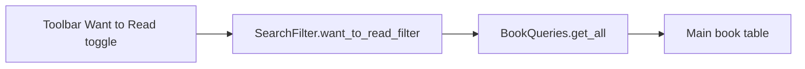

# Want to Read — Future Improvement Plan

**Status:** Planned (not yet implemented)  
**Created:** June 2026  
**Related:** [Collections](help_docs/06_collections.md), [Book Details](help_docs/04_book_details.md), [Reading History](help_docs/13_reading_history.md)

---

## What this is

A **Want to read** (TBR) flag on each book, independent of **collection** and **read date**. Users mark books they plan to listen to, filter the main list to show only those books, and clear the flag automatically when they mark a book as read.

**Option B (this plan):** boolean column on `books` — books **stay in their current collection** (Audible, Audiobooks, etc.). This is **not** a separate "Want to Read" collection.

**User decision:** When `read_date` is set, **automatically clear** `want_to_read`.

---

## Problem

| Today | Gap |
|-------|-----|
| [`SearchFilter`](../src/database/models.py) | `read_filter` (Read/Unread) and `collection_id` only — no TBR intent |
| One `collection_id` per book ([`help_docs/06_collections.md`](../help_docs/06_collections.md)) | A "Want to Read" **collection** would **move** books out of shelving collections |
| Main toolbar | Plot and Read filters exist; no Want to read filter |
| Book Details | No TBR control |

---

## Design

| Concept | Storage | Meaning |
|---------|---------|---------|
| Collection | `collection_id` | Where the book lives — **unchanged** |
| Read / Unread | `read_date` | Finished listening |
| **Want to read** | `want_to_read` (0/1) | User intends to listen |

**Relationships:**

- A book can be **want to read** and **unread** (typical TBR).
- A book can be **read** — `want_to_read` should be **off** (auto-clear when read date set).
- Want to read does **not** change collection.

**Rejected approach (Option A):** auto-created "Want to Read" collection — moves `collection_id`; documented here only for comparison.

---

## Schema

### `books` table

Add in [`connection.py`](../src/database/connection.py) `column_specs["books"]`:

```text
want_to_read  INTEGER DEFAULT 0
```

Update [`test/fixtures/abcdDB_def.sql`](../test/fixtures/abcdDB_def.sql).

### Model and queries

[`models.py`](../src/database/models.py) — `Book`:

```python
want_to_read: bool = False
```

[`queries.py`](../src/database/queries.py):

- `_row_to_book` — map `want_to_read` (truthy if 1)
- `insert` / `update` — include column

Optional bulk helper for v2:

```python
def bulk_set_want_to_read(self, book_ids: List[int], value: bool) -> None
```

---

## Filtering

### `SearchFilter`

[`models.py`](../src/database/models.py):

```python
want_to_read_filter: str = "All"  # All | Want to Read
```

### SQL

[`BookQueries.get_all`](../src/database/queries.py) — after read_filter block (~line 92):

```python
if filter_criteria.want_to_read_filter == "Want to Read":
    query += " AND b.want_to_read = 1"
```

### Filter summary

[`main_window._filter_summary_text`](../src/ui/main_window.py): when active, append e.g. `Want to read` (same pattern as `Read: Read` and `Plot: With Plot`).

---

## Main window UI — [`main_window.py`](../src/ui/main_window.py)

### Toolbar toggle

Mirror [`read_filter_action`](../src/ui/main_window.py) (~line 1215):

| Piece | Detail |
|-------|--------|
| Action | Checkable **Want to Read** on `action_toolbar` |
| Handler | `on_want_to_read_filter_toggled(checked)` → filter `"Want to Read"` or `"All"` |
| Refresh | `refresh_books()`; sync toggle when filters reset |
| Icon | `want_to_read_filter` role in [`icon_helper`](../src/accessibility/icon_helper.py) or reuse decorative icon |

### Shortcut

- **Alt+T** — toggle Want to Read filter (TBR / **T**o-read)
- Register in [`MAIN_WINDOW_SHORTCUTS`](../src/accessibility/shortcuts.py): `"T": ("Toggle want to read filter", "want_to_read_filter_toggle")`
- Wire callback in main window shortcut map (same pattern as `read_filter_toggle` / `on_read_filter_shortcut`)

**Note:** Alt+R = read filter, Alt+P = plot filter on main window.

### View menu (optional v1)

**View → Want to Read** submenu (All / Want to Read) — match plot/read menu rebuild pattern. Toolbar-only is acceptable MVP.

### Mark selected (optional v1)

Footer or toolbar **Mark want to read** when books selected — `bulk_set_want_to_read`. Defer if scope tight; Book Details checkbox is minimum.



---

## Book Details UI — [`book_details.py`](../src/ui/book_details.py)

Add **QCheckBox** on Reader / Read date row (`ROW_READER_READ`) or adjacent row:

```python
self.want_to_read_checkbox = QCheckBox("Want to read")
self.want_to_read_checkbox.setAccessibleName("Want to read")
self.want_to_read_checkbox.setAccessibleDescription(
    "Mark this book as want to read. Cleared automatically when you set a read date."
)
```

| Behavior | Detail |
|----------|--------|
| Load | `setChecked(book.want_to_read)` |
| Save | `on_save` writes `book.want_to_read` from checkbox |
| Dirty | `stateChanged` → `_mark_dirty` (save with Alt+S like other fields) |

Checkbox is keyboard-focusable; no separate Alt+letter required for v1.

---

## Auto-clear on read

Whenever `read_date` is set to a non-empty value, set `want_to_read = 0`.

| Location | Change |
|----------|--------|
| [`book_details.on_save`](../src/ui/book_details.py) | If read date set → clear flag; uncheck checkbox |
| [`main_window.show_read_date_dialog`](../src/ui/main_window.py) | On OK with date → `want_to_read = 0` in DB update |
| Book list import read-date mode | If read date applied → `want_to_read = 0` on update |

When flag was cleared by read date:

```python
set_status("Read date set; removed from want to read", announce=True)
```

Clearing read date does **not** auto-set want to read.

---

## Implementation phases

| Phase | Work | Estimate |
|-------|------|----------|
| 1 | Schema, model, insert/update, query filter | 0.5 day |
| 2 | Toolbar toggle + Alt+T + filter summary + sync | 1 day |
| 3 | Book Details checkbox + save | 1 day |
| 4 | Read-date dialog + import paths auto-clear + tests | 0.5 day |
| 5 | Help docs | 0.5 day |

**Total:** ~3.5–4 days

---

## Tests

| Test | File |
|------|------|
| `get_all` with `want_to_read_filter == "Want to Read"` | `test/test_want_to_read.py` |
| Auto-clear when `read_date` set | `test/test_want_to_read.py` |
| Toolbar toggle syncs filter state | `test/test_main_window_shortcuts_and_menus.py` or new |

---

## Help

- New `help_docs/25_want_to_read.md` (or next free `nn_` prefix)
- Update [`help_docs/06_collections.md`](../help_docs/06_collections.md) — Want to read is a **flag**, not a collection
- Update [`help_docs/04_book_details.md`](../help_docs/04_book_details.md) — checkbox and auto-clear
- [`help_router.py`](../src/ui/help_router.py) — optional Shift+F1 for main window / book details

---

## Accessibility checklist

- [ ] Checkbox: accessible name and description (auto-clear behavior in description)
- [ ] Toolbar action: tooltip + accessible description (match plot/read filters)
- [ ] Filter toggle: `set_status(..., announce=True)`
- [ ] Auto-clear on read: status announcement when flag removed
- [ ] Alt+T in F1 / shortcuts help for main window
- [ ] Block unmapped Alt+letters in text fields unchanged

---

## Out of scope (v1)

- Want to Read as a collection (Option A)
- `previous_collection_id`
- Bulk mark from main window selection (optional)
- Statistics dialog row "Want to read: N" (optional)
- Import Detail checkbox (book not in DB yet)
- Update window bulk TBR

---

## Next steps

Review in fall with other plans ([`plan_ratings.md`](plan_ratings.md), [`Plan_covers.md`](Plan_covers.md), etc.). Self-contained ~4-day feature; no dependency on other fall work.
